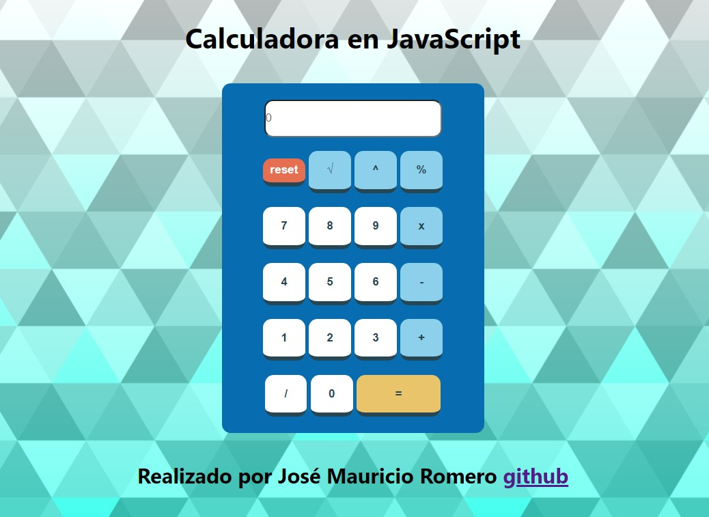

# Calculadora con JavaScript

Ver deploy en [Github pages](https://maitomanito.github.io/Calculadora-JS-main/).

Esta calculadora en javascript incluye las siguientes operaciones.

- Suma
- Resta
- Multiplicación
- División
- Raiz cuiadrada
- Potencia al número que el usuario te diga
- Residuo de una división
- Borrar todos los datos de la calculadora

## Captura  del pokedex:

